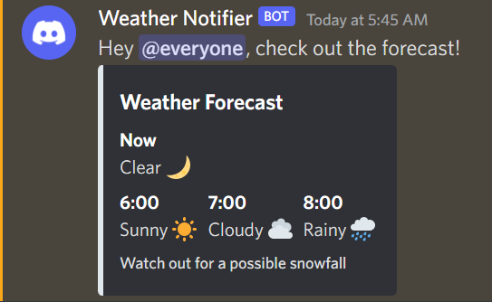
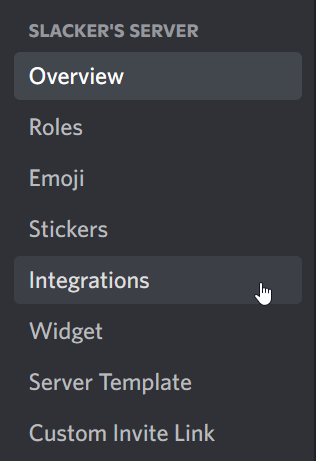

# Discord Webhooks
A simple to use Discord webhooks wrapper made using Arduino C

## Library progress

- [x] Basic implementation
- [ ] Simple docs
- [ ] Send multiple embeds
- [ ] General optimization

## Use cases
- An easy notification system for IoT projects:

<br>


- An easy way of sharing data with a community:

<br>



<hr/>

## Getting started

- Download and install the library
- Create a webhook:

    ### 1. Go to server settings > Integrations
    
    <br>

    

    ### 2. Click on "Create Webhook"
    
    <br>
    
    

    ### 3. Customize your webhook and click on "Save Changes"
    
    <br>
    
    

    ### 4. Copy your Webhook URL
    
    <br>
    
    

- Now that you have your webhook URL, start coding!

<hr/>

## Examples
- ### Basic example:
    Include the needed libraries
    ```cpp
    #include <ESP8266WiFi.h>
    #include <ESP8266WiFiMulti.h>
    #include "DiscordWebhook.h"
    ```

    Set your credentails
    ```cpp
    #define SSID "<your ssid>"
    #define PASS "<your password>"
    #define DISCORD_WEBHOOK_URL "<your discord webhook url>"
    ```

    Define your variables and connect to WiFi
    ```cpp
    ESP8266WiFiMulti wifi_multi;
    DiscordWebhook discord_webhook;

    void connect_to_wifi()
    {
        WiFi.mode(WIFI_STA);
        wifi_multi.addAP(SSID, PASS);

        Serial.printf("Connecting to %s\n", SSID);
        while (wifi_multi.run() != WL_CONNECTED)
            delay(50);
        Serial.println("Connected to WiFi");
    }
    ```

    Run setup
    ```cpp
    void setup()
    {
        Serial.begin(115200);
        connect_to_wifi();

        discord_webhook.begin(DISCORD_WEBHOOK_URL);
    ...
    ```

    Start sending webhooks
    ```cpp
        bool success = discord_webhook.send("Hello World!");

        Serial.printf("Sending webhook %s\n", success ? "succeeded!" : "failed.");
    } // end of setup
    ```

    Full code:
    ```cpp
    #include <ESP8266WiFi.h>
    #include <ESP8266WiFiMulti.h>
    #include "DiscordWebhook.h"

    #define SSID "<your ssid>"
    #define PASS "<your password>"
    #define DISCORD_WEBHOOK_URL "<your discord webhook url>"

    ESP8266WiFiMulti wifi_multi;
    DiscordWebhook discord_webhook;

    void connect_to_wifi()
    {
        WiFi.mode(WIFI_STA);
        wifi_multi.addAP(SSID, PASS);

        Serial.printf("Connecting to %s\n", SSID);
        while (wifi_multi.run() != WL_CONNECTED)
            delay(50);
        Serial.println("Connected to WiFi");
    }

    void setup()
    {
        Serial.begin(115200);
        connect_to_wifi();

        discord_webhook.begin(DISCORD_WEBHOOK_URL);
        bool success = discord_webhook.send("Hello World!");

        Serial.printf("Sending webhook %s\n", success ? "succeeded!" : "failed.");
    }

    void loop()
    {
    }
    ```

- ### Using Embeds
    ```cpp
    void setup()
    {
        Serial.begin(115200);
        connect_to_wifi();

        discord_webhook.begin(DISCORD_WEBHOOK_URL);

        DiscordEmbed embed;
        embed.setTitle("Weather Forecast")
            ->setColor(DiscordEmbed::rgbToHex(225, 232, 237))
            ->addField("Now", "Clear 🌙", false)
            ->addField("6:00", "Sunny ☀", true)
            ->addField("7:00", "Cloudy ☁", true);

        EmbedField field1;
        field1.name = "8:00";
        field1.value = "Rainy 🌧";
        field1.is_inline = true;

        embed.addField(field1);

        EmbedFooter footer;
        footer.text = "Watch out for a possible snowfall";

        embed.setFooter(footer);
    
        bool success = discord_webhook.send(embed);
    ```
    #### or send an embed with a message
    ```cpp
        bool success = discord_webhook.send("Hey @everyone, check out the forecast!", embed);

        Serial.printf("Sending webhook %s\n", success ? "succeeded!" : "failed.");
    }
    ```

<hr/>

## Docs

- ### DiscordWebhook
    #### Methods:
    - ```cpp
        void begin(const String &url)
        ``` 
        Stores your webhook url for later use.

        params:

        - `url`: discord webhook URL

        returns:

        - nothing   
    
    <br/>

    - ```cpp
        bool send(const String &text)
        ```
        Sends a POST request to the webhook url.

        params:

        - `text`: discord message content

        returns:

        - `true` if response status code == 204 else `false`

    <br/>

    - ```cpp
        bool send(const String &text, const bool &tts)
        ```
        params:

        - `text`: discord message content
        - `tts`: `true` or `false` if the message is text to speech  

        returns:

        - `true` if response status code == 204 else `false`

    <br/>

    - ```cpp
        bool send(const DiscordEmbed &embed)
        ```
        Send discord embed.

        params:

        - `embed`: a `DiscordEmbed` instance as the message embed

        returns:

        - `true` if response status code == 204 else `false`

    <br/>

    - ```cpp
        bool send(const String &text, const DiscordEmbed &embed)
        ```
        Send an embed with text above it as the message content.
        
        params:

        - `text`: discord message content
        - `embed`: a `DiscordEmbed` instance as the message embed

        returns:

        - `true` if response status code == 204 else `false`
